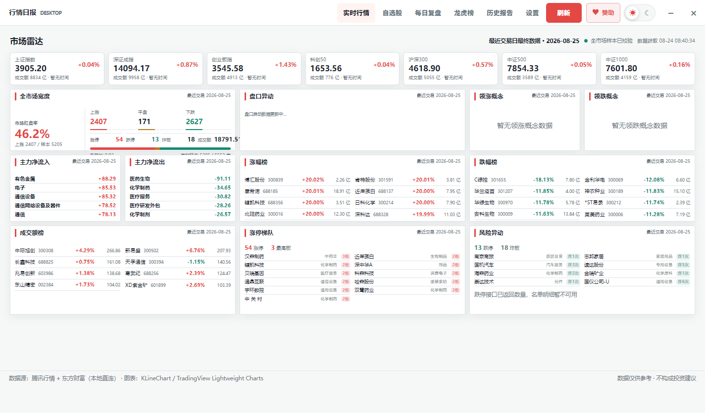
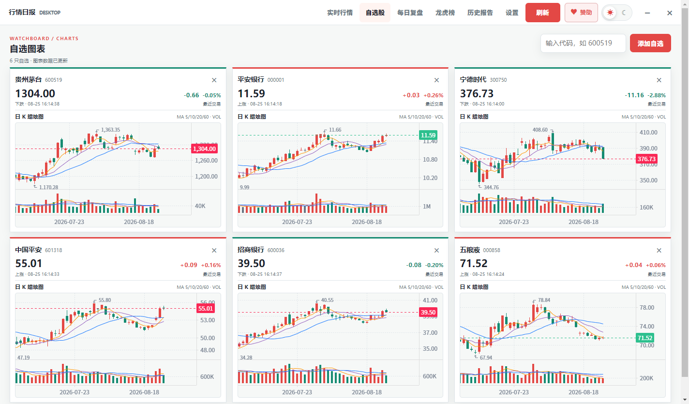
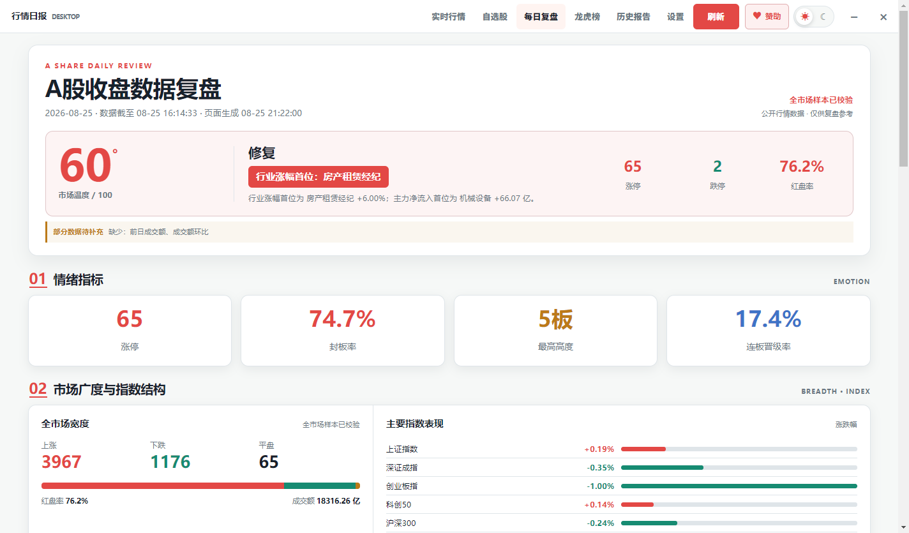
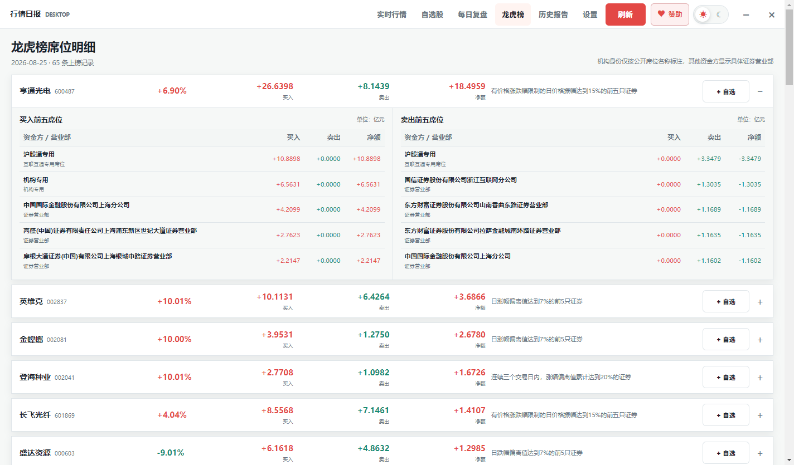
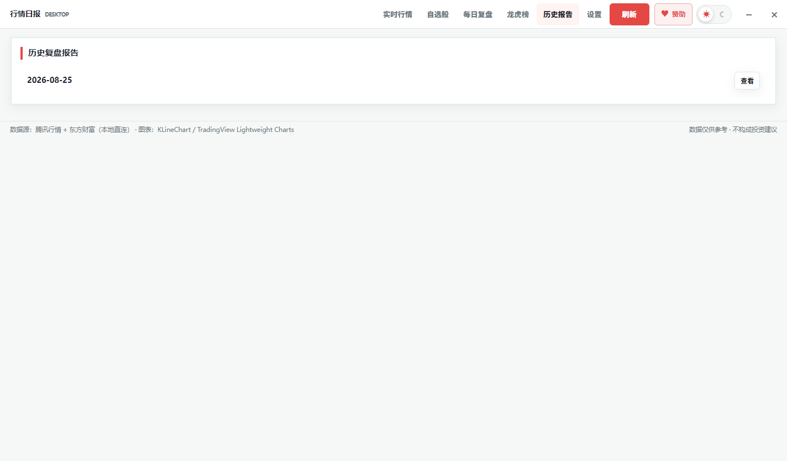

# 股市脉搏

<p align="center">
  
</p>

股市脉搏是一套面向 A 股盘面观察与收盘整理的本地优先工具。当前主产品是 Windows Electron 桌面版，提供实时行情、市场宽度、概念与资金、盘口异动、自选股、龙虎榜和每日复盘；仓库同时保留一个简单的 Web 官网，用于介绍桌面版和提供安装包下载入口。未来可能增加独立的 App 端。

官网：[https://dailystock.zhicha.io](https://dailystock.zhicha.io)

> 本项目只展示和整理公开行情数据，不提供荐股、交易指令或收益承诺。所有指标仅供参考，不构成投资建议。

## 下载

当前 Windows 版本：`0.3.7`

- [Windows 64 位安装包（境内·OSS）](https://oss.askcode.cn/files/hangqing-desktop-0.3.7-win-x64-setup.exe)：适用于绝大多数 Windows 10/11 电脑，经阿里云 OSS + CDN 加速。
- [Windows 32 位安装包（境内·OSS）](https://oss.askcode.cn/files/hangqing-desktop-0.3.7-win-ia32-setup.exe)：仅用于 32 位 Windows。
- [海外·GitHub x64](https://github.com/rjf1979/review_stock/releases/download/v0.3.7/hangqing-desktop-0.3.7-win-x64-setup.exe) · [海外·GitHub x86](https://github.com/rjf1979/review_stock/releases/download/v0.3.7/hangqing-desktop-0.3.7-win-ia32-setup.exe) · [OSS 备用镜像 x64](https://my-soft-2026.oss-cn-shanghai.aliyuncs.com/files/hangqing-desktop-0.3.7-win-x64-setup.exe) · [OSS 备用镜像 x86](https://my-soft-2026.oss-cn-shanghai.aliyuncs.com/files/hangqing-desktop-0.3.7-win-ia32-setup.exe) · [GitHub Release 与全部版本](https://github.com/rjf1979/review_stock/releases)。

境内主下载经阿里云 OSS + CDN（HTTPS），海外请走 GitHub Release 原站链接，官网服务器不再挂载安装包。安装包暂未进行代码签名，Windows 可能显示“未知发布者”提示，请下载后核对发布页提供的 SHA-256。

## 使用许可

本项目采用 [Hangqing Personal Non-Commercial Source License 1.0](LICENSE)，属于源码可见的个人非商业许可，不是 OSI 定义的开源许可证。

- 允许个人为非商业目的查看、运行、复制和修改。
- 未经版权方事先书面授权，禁止公司内部使用、收费服务、广告获利、代开发、转售、SaaS、商业产品集成以及其他直接或间接商业使用。
- 未经授权的商业使用将导致许可自动终止，版权方保留停止侵权、追究责任和索赔损失的权利。
- 第三方依赖、图表库及素材仍按各自许可证和 NOTICE 文件执行。

## 功能概览

### 桌面版

- **实时盘面**：指数、上涨/下跌家数、涨停/跌停/炸板、成交额榜、涨跌幅榜、领涨/领跌概念、行业主力资金和盘口异动。
- **交易时段刷新**：上海时区 `09:30-11:30`、`13:00-15:00` 自动刷新；闭市后展示最近一次有效交易数据。
- **每日复盘**：工作日 `12:00` 生成午间快照，`16:00` 生成收盘复盘，并保存到本地历史记录。
- **独立工具**：自选股、K 线、龙虎榜、历史报告、亮色/暗色主题和系统通知。
- **桌面体验**：默认适配当前屏幕工作区，窗口锁定最大化布局，支持最小化、关闭到托盘和单实例运行。
- **在线升级**：启动后检查官网版本，此后每 6 小时复查；按系统架构下载并校验 SHA-256 后重启升级。
- **本地数据**：设置、自选股、行情快照和复盘记录保存在当前 Windows 用户的 SQLite 数据库中，无需注册账号或安装数据库服务。

### 桌面版页面预览

#### 实时行情

集中展示主要指数、全市场宽度、涨跌停与炸板、行业资金、涨跌榜、连板梯队和盘口异动。交易时段自动刷新，闭市后保留最近交易日的有效快照。



#### 自选股

采用一行三列的图表布局，一屏可观察 6 只股票。每张行情卡包含日 K 蜡烛图、MA5/10/20/60 均线和 VOL 成交量，免费版自选股最多保存 9 只。



#### 每日复盘

使用确定性模板整理市场温度、情绪指标、市场宽度、指数结构、连板高度、行业资金和今日要闻。复盘结果完整保存到本地 SQLite，重复打开时优先读取缓存。



#### 龙虎榜

按股票列出买入、卖出和净额，并展开买卖前五席位。公开数据能识别机构时明确标注机构，其他资金方显示具体证券营业部，同时支持将上榜股票直接加入自选股。



#### 历史报告

按交易日列出已经完整落地的复盘快照，可直接打开历史日期查看，避免使用当前行情冒充历史数据。



### Web 官网

- **产品介绍**：说明桌面版的定位、功能、工作方式和本地数据特点。
- **安装下载**：提供 Windows x64、Windows 32 位安装包和 GitHub Release 入口。
- **当前边界**：官网不承载行情采集、报告服务、后台管理、邮件订阅或用户数据。

### 未来 App 端

- `src/app/` 目前只是移动端工程占位，没有可运行代码。
- 后续将单独确定平台、技术栈、数据访问、同步、离线、通知和发布策略。
- 移动端不直接依赖 Electron 桌面端主进程或本地 HTTP 服务。

## 技术架构

```text
src/desktop/
  Electron 主进程
    ├─ Vue 3 单页工作台
    ├─ 本地 Node HTTP 服务 :3100
    ├─ 腾讯 / 东方财富公开行情接口
    └─ sql.js SQLite 用户数据

src/web/
  Vue 3 + Vite 官网
    ├─ 桌面版产品介绍
    ├─ Windows 安装包下载入口
    └─ 静态资源服务 :3000

src/app/
  未来 App 端工程占位
```

## 快速开始

### 运行桌面版

环境要求：Windows 10/11、Node.js 20 LTS 或更高版本、npm。

```powershell
cd src/desktop
npm ci
npm run check
npm run desktop
```

桌面应用会自动启动内置本地服务。只调试本地服务与浏览器界面时可运行：

```powershell
cd src/desktop
npm start
```

启动后通过终端提示的本地调试地址访问。

### 运行 Web 平台

Web 端当前是桌面版官网，需要 Node.js 和 npm，不需要 PostgreSQL 或其他业务服务。

```powershell
cd src/web
Copy-Item .env.example .env
npm ci
npm run build
npm start
```

线上官网地址为 [https://dailystock.zhicha.io](https://dailystock.zhicha.io)。官网服务只读取 `PORT` 环境变量，不需要数据库或后台授权配置。

## Windows 打包

桌面版当前版本为 `0.3.7`。构建目录和安装包输出到 `src/desktop/release/`，该目录已被 Git 忽略。

```powershell
cd src/desktop
npm run pack
```

项目的 [NSIS 安装脚本](src/desktop/installer.nsi) 支持 `x64` 和 `ia32` 两种架构。准备好对应的 `win-unpacked` / `win-ia32-unpacked` 目录后，可分别生成：

```text
hangqing-desktop-<version>-win-x64-setup.exe
hangqing-desktop-<version>-win-ia32-setup.exe
```

安装器行为：

- 首次安装会创建桌面和开始菜单快捷方式。
- 安装包版本高于已安装版本时，询问后覆盖升级。
- 版本相同时提示无需更新，不重复覆盖文件。
- 安装包版本低于已安装版本时阻止降级。
- 卸载会删除程序、依赖、快捷方式和卸载登记，但保留本地数据库、复盘、设置和缓存。

在线升级发布时，将最终 x64/ia32 安装包放入 `src/desktop/release/`，运行 `npm run updates:manifest` 自动生成官网升级清单。先上传两个安装包到官网 `/updates/files/`，验证 HTTPS 下载与 SHA-256 后，再替换 `/updates/latest.json`；清单必须最后发布，避免客户端提前看到尚未就绪的版本。

详见 [桌面安装与本地数据说明](docs/desktop-install.md)。
在线升级的清单格式、官网目录、发布顺序与回滚方式见 [桌面版在线升级](docs/desktop-update.md)。

## 本地数据

正式桌面版数据库位于 Electron `userData` 目录：

```text
<Electron userData>/hangqing.sqlite
```

主要数据表：

| 表 | 用途 |
| --- | --- |
| `settings` | 主题、刷新频率、通知和调度状态 |
| `watchlist` | 当前用户的自选股 |
| `market_snapshots` | 最近一次有效行情快照 |
| `reviews` | 每日复盘 Markdown 与索引 |
| `schema_meta` | 数据迁移标记 |

覆盖升级和卸载均保留该目录。需要清空数据时，应先退出应用并自行备份数据库。

## 数据来源与口径

- 腾讯公开接口：A 股指数、个股、K 线及部分海外指数。
- 东方财富公开接口：市场宽度、涨跌停池、炸板池、概念、行业资金、盘口异动、龙虎榜、新闻和股指期货。
- 股指期货公开行情可能延迟约 15 分钟；会员多空数据属于上一交易日公开结算口径。
- 免费公开接口可能限流、延迟、调整字段或暂时不可用。应用会尽量使用最近有效快照，不伪造缺失数据。
- 当前定时复盘按上海时区工作日判断，尚未接入完整交易所节假日日历。

## 目录说明

| 路径 | 内容 |
| --- | --- |
| `src/desktop/` | Electron 桌面应用、本地行情服务、SQLite 和安装器 |
| `src/web/` | Vue 官网、下载入口和静态服务 |
| `src/app/` | 未来 App 端工程边界与占位说明 |
| `docs/` | 桌面版设计、安装和数据源说明 |
| `.agents/skills/` | 本项目行情采集、日报与 UI 工程规则 |
| `.codex/memory/` | 项目决策与短期开发记录 |

## 开发检查

桌面端改动至少执行：

```powershell
cd src/desktop
npm run check
git diff --check
```

涉及安装器时还应验证 x64/ia32 PE 架构、NSIS 编译退出码与 CRC、版本覆盖逻辑、快捷方式图标，以及卸载后本地数据库是否保持不变。

## 相关文档

- [桌面版设计方案](docs/desktop-design.md)
- [桌面安装与本地数据说明](docs/desktop-install.md)
- [v0.1.1 发布说明](docs/releases/v0.1.1.md)
- [源码目录说明](src/README.md)
- [Web 官网说明](src/web/README.md)

## 免责声明

行情日报仅提供公开行情数据的展示、统计和整理。市场温度、情绪指标、板块强弱、资金流和复盘内容不代表未来走势，不构成任何投资建议或买卖依据。数据可能存在延迟、缺失或错误，使用者应独立核验并自行承担决策风险。股市有风险，投资需谨慎。
